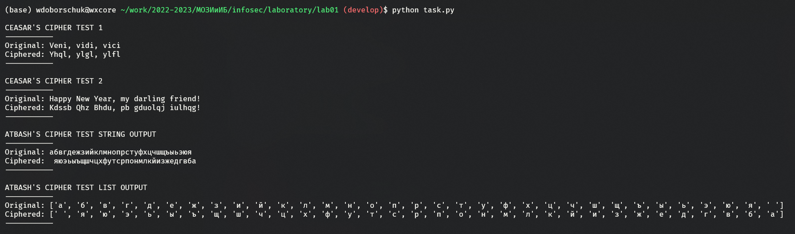

---
## Front matter
lang: ru-RU
title: Лабораторная работа №1
subtitle: Шифры простой замены
author:
  - Доборщук В.В.
institute:
  - Российский университет дружбы народов, Москва, Россия
date: 17 сентября 2022

## i18n babel
babel-lang: russian
babel-otherlangs: english

## Formatting pdf
toc: false
toc-title: Содержание
slide_level: 2
aspectratio: 169
section-titles: true
theme: metropolis
header-includes:
 - \metroset{progressbar=frametitle,sectionpage=progressbar,numbering=fraction}
 - '\makeatletter'
 - '\beamer@ignorenonframefalse'
 - '\makeatother'
---

# Информация

## Докладчик

:::::::::::::: {.columns align=center}
::: {.column width="70%"}

  * Доборщук Владимир Владимирович
  * студент группы НФИмд-02-22, студ. билет 1132223451
  * учебный ассистент кафедры прикладной информатики и теории вероятностей
  * Российский университет дружбы народов
  * [1132223451@rudn.ru](mailto:1132223451@rudn.ru)

:::
::: {.column width="30%"}


:::
::::::::::::::

# Цели и задачи

**Цель работы** --- изучить и программно реализовать шифры простой замены.

Задачами являются:

- Реализовать шифр Цезаря с произвольным ключом $k$;
- Реализовать шифр Атбаш.

# Теоретическое введение

В основе функционирования шифров простой замены лежит следующий принцип: для получения шифртекста отдельные символы или группы символов исходного алфавита заменяются символами или группами символов шифроалфавита. 

## Шифр Цезаря

**Шифр Цезаря** является моноалфавитной подстановкой, т.е. каждой букве открытого текста ставится в соответствие одна буква шифротекста.

Математическая процедура шифрования описывается как

$$
T_m = \left\{T^j\right\},j=0,1,\cdots,m-1,
$$

$$
T^j(a)=(a+j)\mod{m},
$$

Сам же Цезарь обычно использовал подстановку $T^3$.

## Шифр Атбаш

**Шифр Атбаш** является сдвигом на всю длину алфавита. Правило шифрования состоит в замене $i$-й буквы алфавита буквой с номером $n-i+1$, где $n$ — число букв в алфавите.

# Выполнение лабораторной работы

Для реализации шифров мы будем использовать Python, так как его синтаксис позволяет быстро реализовать необходимые нам алгоритмы.

## Реализация шифра Цезаря c произвольным ключом $k$

```python
# --- Ceasar's Cipher ---
def ceasar(letter: chr, key: int, alphabet: list):
    def ceasar(letter: chr, key: int):
        return alphabet.index(letter) + key
    
    if letter.lower() not in alphabet:
        return letter
    
    t_letter = alphabet[ceasar(letter.lower(), key) % len(alphabet)]
    
    if letter.isupper():
        t_letter = t_letter.upper()    
        
    return t_letter
```

## Реализация шифра Атбаша

```python
# --- Atbash's Cipher ---
def atbash(letter: chr, alphabet: list):
    if letter.lower() not in alphabet:
        return letter
    
    t_letter = alphabet[len(alphabet) - alphabet.index(letter.lower()) - 1]
    
    if letter.isupper():
        t_letter = t_letter.upper()    
        
    return t_letter
```

## Тестирование

Для тестирования мы создали следующие функции:

```python
# --- Tests ---
def test_ceasar(message: str, key: int, alphabet: list):
    ciphered_message = list(map(
      lambda letter: ceasar(letter, key, alphabet), message)
    )
    return "".join(ciphered_message)

def test_atbash(message: str, alphabet: list):
    ciphered_message = list(map(
      lambda letter: atbash(letter, alphabet), message)
    )
    return "".join(ciphered_message)
```

Данные тесты возвращают строку шифро-текста.

## Результаты тестирования

{ #fig:001 width=80% }

## Результаты тестирования

Для шифра Цезаря с ключом $k=3$ получаем следующий результат:

```text
CEASAR'S CIPHER TEST 1
-----------
Original: Veni, vidi, vici
Ciphered: Yhql, ylgl, ylfl
-----------
```

## Результаты тестирования

Дополнительно проверим механизм шифрования, передав другую строку из букв латинского алфавита:

```text
CEASAR'S CIPHER TEST 2
-----------
Original: Happy New Year, my darling friend!
Ciphered: Kdssb Qhz Bhdu, pb gduolqj iulhqg!
-----------
```

## Результаты тестирования

Шифр Атбаш мы проверяем на кириллическом алфавите, содержащим также в себе символ пробела. Для проверки, передадим в него также весь русский алфавит с пробелом в виде одной строки:

```text
ATBASH'S CIPHER TEST STRING OUTPUT
-----------
Original: абвгдежзийклмнопрстуфхцчшщъыьэюя
Ciphered:  яюэьыъщшчцхфутсрпонмлкйизжедгвба
-----------
```
## Результаты тестирования

Выведем полученный результат в формате спсика, где сможем рассмотреть каждый обработанный символ отдельно:

```text
ATBASH'S CIPHER TEST LIST OUTPUT
-----------
Original: ['а', 'б', 'в', 'г', 'д', 'е', 'ж', 'з', 'и', 'й', 'к', 'л', 'м', 
           'н', 'о', 'п', 'р', 'с', 'т', 'у', 'ф', 'х', 'ц', 'ч', 'ш', 'щ', 
           'ъ', 'ы', 'ь', 'э', 'ю', 'я', ' ']
Ciphered: [' ', 'я', 'ю', 'э', 'ь', 'ы', 'ъ', 'щ', 'ш', 'ч', 'ц', 'х', 'ф', 
           'у', 'т', 'с', 'р', 'п', 'о', 'н', 'м', 'л', 'к', 'й', 'и', 'з', 
           'ж', 'е', 'д', 'г', 'в', 'б', 'а']
-----------
```

# Выводы

В рамках выполненной лабораторной работы мы изучили и реализовали следующие шифры простой замены: шифр Цезаря (с произвольным ключом $k$) и шифр Атбаш.