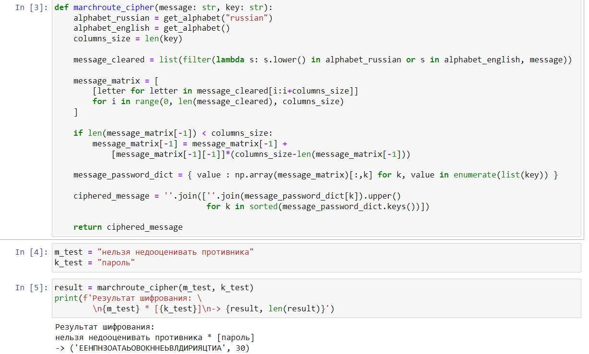

---
## Front matter
lang: ru-RU
title: Лабораторная работа №2
subtitle: Шифры перестановки
author:
  - Доборщук В.В.
institute:
  - Российский университет дружбы народов, Москва, Россия
date: 1 октября 2022

## i18n babel
babel-lang: russian
babel-otherlangs: english

## Formatting pdf
toc: false
toc-title: Содержание
slide_level: 2
aspectratio: 169
section-titles: true
theme: metropolis
header-includes:
 - \metroset{progressbar=frametitle,sectionpage=progressbar,numbering=fraction}
 - '\makeatletter'
 - '\beamer@ignorenonframefalse'
 - '\makeatother'
---

# Информация

## Докладчик

:::::::::::::: {.columns align=center}
::: {.column width="70%"}

  * Доборщук Владимир Владимирович
  * студент группы НФИмд-02-22, студ. билет 1132223451
  * учебный ассистент кафедры прикладной информатики и теории вероятностей
  * Российский университет дружбы народов
  * [1132223451@rudn.ru](mailto:1132223451@rudn.ru)

:::
::: {.column width="30%"}

:::
::::::::::::::

# Цели и задачи

**Цель работы** --- изучить и программно реализовать шифры перестановки.

Задачами являются:

- Реализовать все описанные в лабораторной работе шифры.

# Теоретическое введение

Шифры перестановки преобразуют открытый текст в криптограмму путем перестановки его символов.

# Выполнение лабораторной работы

Для реализации шифров мы будем использовать Python, так как его синтаксис позволяет быстро реализовать необходимые нам алгоритмы.

{ #fig:001 width=70% }

Также реализовали функции получения алфавитов (английского и русского).

## Маршрутное шифрование

Маршрутное шифрование реализовали в соответствии с описанной в лабораторной работе процедурой. Успешно протестировали на приведенном в работе отрывке.

{ #fig:002 width=70% }

## Шифрование с помощью решеток

Данный вид шифрования не удалось реализовать.

## Таблица Виженера

Маршрутное шифрование реализовали в соответствии с описанной в лабораторной работе процедурой. Успешно протестировали на приведенном в работе отрывке (с учетом, что русский алфавит немного изменен).

{ #fig:003 width=70% }

# Выводы

В рамках выполненной лабораторной работы мы изучили и реализовали следующие шифры перестановки: маршрутное шифрование и таблицу Виженера. Реализовать шифрование с помощью решеток не удалось.
