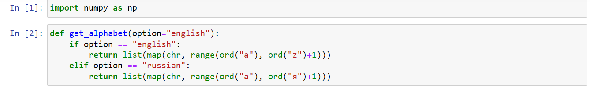
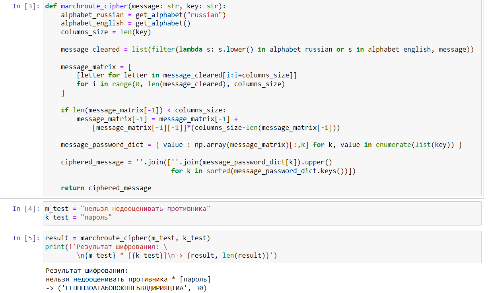
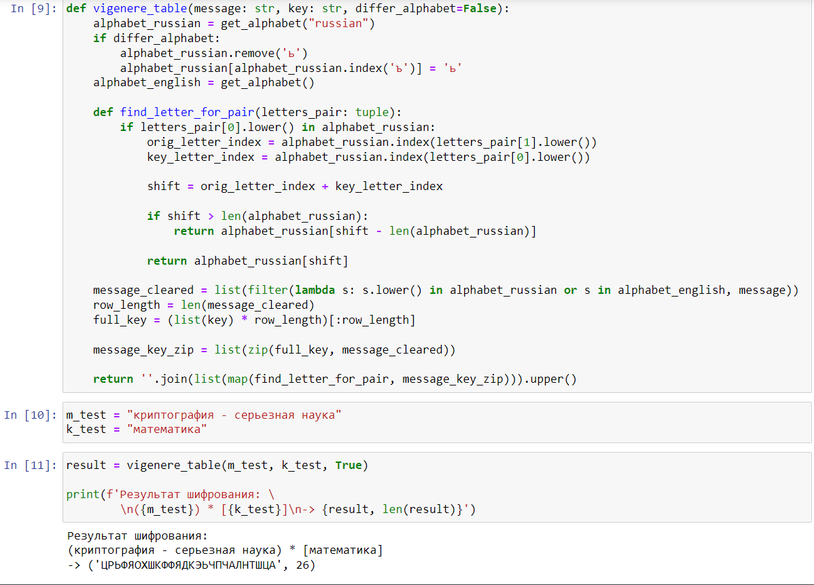

---
## Front matter
title: "Лабораторная работа №2"
subtitle: "Шифры перестановки"
author: "Доборщук Владимир Владимирович, НФИмд-02-22"

## Generic otions
lang: ru-RU
toc-title: "Содержание"

## Bibliography
bibliography: bib/cite.bib
csl: /home/wdoborschuk/work/2022-2023/МОЗИиИБ/infosec/.report/pandoc/csl/gost-r-7-0-5-2008-numeric.csl

## Pdf output format
toc: true # Table of contents
toc-depth: 2
lof: true # List of figures
lot: true # List of tables
fontsize: 12pt
linestretch: 1.5
papersize: a4
documentclass: scrreprt
## I18n polyglossia
polyglossia-lang:
  name: russian
  options:
	- spelling=modern
	- babelshorthands=true
polyglossia-otherlangs:
  name: english
## I18n babel
babel-lang: russian
babel-otherlangs: english
## Fonts
mainfont: PT Serif
romanfont: PT Serif
sansfont: PT Sans
monofont: PT Mono
mainfontoptions: Ligatures=TeX
romanfontoptions: Ligatures=TeX
sansfontoptions: Ligatures=TeX,Scale=MatchLowercase
monofontoptions: Scale=MatchLowercase,Scale=0.9
## Biblatex
biblatex: true
biblio-style: "gost-numeric"
biblatexoptions:
  - parentracker=true
  - backend=biber
  - hyperref=auto
  - language=auto
  - autolang=other*
  - citestyle=gost-numeric
## Pandoc-crossref LaTeX customization
figureTitle: "Рис."
tableTitle: "Таблица"
listingTitle: "Листинг"
lofTitle: "Список иллюстраций"
lotTitle: "Список таблиц"
lolTitle: "Листинги"
## Misc options
indent: true
header-includes:
  - \usepackage{indentfirst}
  - \usepackage{float} # keep figures where there are in the text
  - \floatplacement{figure}{H} # keep figures where there are in the text
---

# Цель работы

Цель данной работы --- изучить и программно реализовать шифры перестановки.

# Задание

Заданием является:

- Реализовать все описанные в лабораторной работе шифры.

# Теоретическое введение

Шифры перестановки преобразуют открытый текст в криптограмму путем перестановки его символов.

# Выполнение лабораторной работы

Для реализации шифров мы будем использовать Python, так как его синтаксис позволяет быстро реализовать необходимые нам алгоритмы.

Использовали библиотеки, представленные на рисунке [-@fig:001].

{ #fig:001 width=100% }

Также реализовали функции получения алфавитов (английского и русского).

## Маршрутное шифрование

Маршрутное шифрование реализовали в соответствии с описанной в лабораторной работе процедурой. Успешно протестировали на приведенном в работе отрывке.  Результаты и программный код представлены на рисунке [-@fig:002].

{ #fig:002 width=100% }

## Шифрование с помощью решеток

Данный вид шифрования не удалось реализовать.

## Таблица Виженера

Маршрутное шифрование реализовали в соответствии с описанной в лабораторной работе процедурой. Успешно протестировали на приведенном в работе отрывке (с учетом, что русский алфавит немного изменен). Результаты и программный код представлены на рисунке [-@fig:003].

{ #fig:003 width=100% }

# Выводы

В рамках выполненной лабораторной работы мы изучили и реализовали следующие шифры перестановки: маршрутное шифрование и таблицу Виженера. Реализовать шифрование с помощью решеток не удалось.

# Список литературы{.unnumbered}

::: {#refs}
:::
