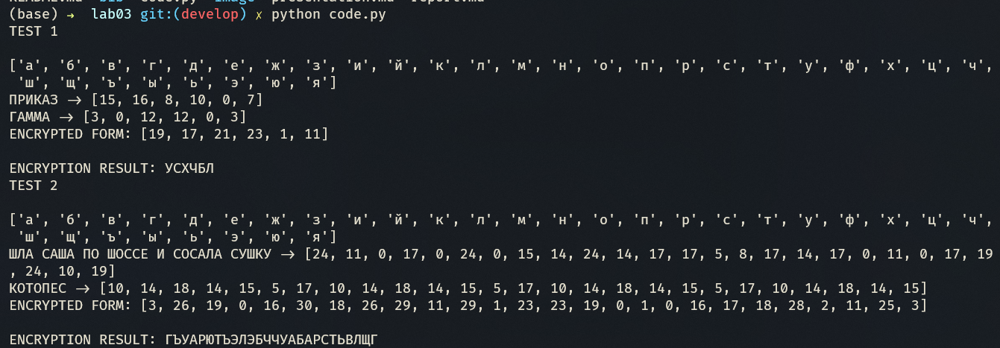

---
## Front matter
lang: ru-RU
title: Лабораторная работа №3
subtitle: Шифрование гаммированием
author:
  - Доборщук В.В.
institute:
  - Российский университет дружбы народов, Москва, Россия
date: 15 октября 2022

## i18n babel
babel-lang: russian
babel-otherlangs: english

## Formatting pdf
toc: false
toc-title: Содержание
slide_level: 2
aspectratio: 169
section-titles: true
theme: metropolis
header-includes:
 - \metroset{progressbar=frametitle,sectionpage=progressbar,numbering=fraction}
 - '\makeatletter'
 - '\beamer@ignorenonframefalse'
 - '\makeatother'
 - \usepackage{fvextra}
 - \DefineVerbatimEnvironment{Highlighting}{Verbatim}{breaklines,commandchars=\\\{\}}
---

# Информация

## Докладчик

:::::::::::::: {.columns align=center}
::: {.column width="70%"}

  * Доборщук Владимир Владимирович
  * студент группы НФИмд-02-22, студ. билет 1132223451
  * учебный ассистент кафедры прикладной информатики и теории вероятностей
  * Российский университет дружбы народов
  * [doborschuk-vv@rudn.ru](mailto:doborschuk-vv@rudn.ru)

:::
::: {.column width="30%"}


:::
::::::::::::::

# Цели и задачи

**Цель работы** --- изучить методы шифрования гаммированием.

Задачами являются:

- Реализовать алгоритм шифрования гаммированием конечной гаммы

# Теоретическое введение

*Гаммирование* - процедура наложения при помощи некоторой функции $F$ на исходный текст *гаммы* шифра, т.е. *псевдослучайной последователыюсти (ПСП)* с выходов генератора $\mathbb{G}$. Псевдослучайная последовательность по своим статистическим свойствам неотличима от случайной последовательности, но является детерминированной, т.е. известен алгоритм ее формирования. Чаще Обычно в качестве функции $F$ берется операция поразрядного сложения по модулю два или по модулю $N$ ($N$ - число букв алфавита открытого текста).

## Шифрование гаммированием

Простейший генератор псевдослучайной последовательности можно представить рекуррентным соотношением: 

$$
\gamma_i = a\cdot\gamma_{i-1} + b\:\mathnormal{mod(m)}, i = \overline{1,m}
$$

# Выполнение лабораторной работы

Для реализации шифров мы будем использовать Python, так как его синтаксис позволяет быстро реализовать необходимые нам алгоритмы.

## Модули и вспомогательные фукнции

Дополнительно мы используем библиотеку `numpy` и импортируем её.

\scriptsize
```python
import numpy as np
```
\normalsize

Также, реализовали функцию получения английского и русского алфавита.

\scriptsize
```python
# Cyrillic or Latin alphabet getter
def get_alphabet(option="eng"):
    if option == "eng":
        return list(map(chr, range(ord("a"), ord("z")+1)))
    elif option == "rus":
        return list(map(chr, range(ord("а"), ord("я")+1)))
```
\normalsize

## Реализация шифрования конечной гаммы

\scriptsize
```python
# Gamma Encryption
def gamma_encryption(message: str, gamma: str):
    alphabet = get_alphabet()
    if message.lower() not in alphabet:
        alphabet = get_alphabet("rus")
    
    print(alphabet)
    m = len(alphabet)

    def encrypt(letters_pair: tuple):
        idx = (letters_pair[0] + 1) + (letters_pair[1] + 1) % m
        if idx > m:
            idx = idx - m

        return idx - 1
```
\normalsize

## Реализация шифрования конечной гаммы

\scriptsize
```python
    message_cleared = list(filter(lambda s: s.lower() in alphabet, message))
    gamma_cleared = list(filter(lambda s: s.lower() in alphabet, gamma))
    
    message_indices = list(map(lambda s: alphabet.index(s.lower()), message_cleared))
    gamma_indices = list(map(lambda s: alphabet.index(s.lower()), gamma_cleared))
    
    for i in range(len(message_indices) - len(gamma_indices)):
        gamma_indices.append(gamma_indices[i])

    print(f'{message.upper()} -> {message_indices}\n{gamma.upper()} -> {gamma_indices}')

    encrypted_indices = list(map(lambda s: encrypt(s), zip(message_indices, gamma_indices)))
    print(f"ENCRYPTED FORM: {encrypted_indices}\n")
    
    return ''.join(list(map(lambda s: alphabet[s], encrypted_indices))).upper()
```
\normalsize

## Тестирование

Для тестирования мы создали следующую функцию, которую вызываем в блоке *Main*:

\scriptsize
```python
# --- Tests ---
def test_encryption(message: str, gamma: str):
    print(f'ENCRYPTION RESULT: {gamma_encryption(message, gamma)}')
```
\normalsize

## Тестирование

Для вызова теста, реализуем функцию `main` следующим образом:

\scriptsize
```python
# --- Main function ---
def main():
    message = "приказ"
    gamma = "гамма"

    print("TEST 1\n")
    test_encryption(message, gamma)

    message = "Шла Саша по шоссе и сосала сушку"
    gamma = "Котопес"

    print("TEST 2\n")
    test_encryption(message, gamma)
```
\normalsize

## Результаты тестирования

{ #fig:001 width=80% }

## Результаты тестирования

\scriptsize
```sh
TEST 1

['а', 'б', 'в', 'г', 'д', 'е', 'ж', 'з', 'и', 'й', 'к', 'л', 'м', 'н', 'о', 'п', 'р', 'с', 'т', 'у', 'ф', 'х', 'ц', 'ч', 'ш', 'щ', 'ъ', 'ы', 'ь', 'э', 'ю', 'я']
ПРИКАЗ -> [15, 16, 8, 10, 0, 7]
ГАММА -> [3, 0, 12, 12, 0, 3]
ENCRYPTED FORM: [19, 17, 21, 23, 1, 11]

ENCRYPTION RESULT: УСХЧБЛ

TEST 2

['а', 'б', 'в', 'г', 'д', 'е', 'ж', 'з', 'и', 'й', 'к', 'л', 'м', 'н', 'о', 'п', 'р', 'с', 'т', 'у', 'ф', 'х', 'ц', 'ч', 'ш', 'щ', 'ъ', 'ы', 'ь', 'э', 'ю', 'я']
ШЛА САША ПО ШОССЕ И СОСАЛА СУШКУ -> [24, 11, 0, 17, 0, 24, 0, 15, 14, 24, 14, 17, 17, 5, 8, 17, 14, 17, 0, 11, 0, 17, 19, 24, 10, 19]
КОТОПЕС -> [10, 14, 18, 14, 15, 5, 17, 10, 14, 18, 14, 15, 5, 17, 10, 14, 18, 14, 15, 5, 17, 10, 14, 18, 14, 15]
ENCRYPTED FORM: [3, 26, 19, 0, 16, 30, 18, 26, 29, 11, 29, 1, 23, 23, 19, 0, 1, 0, 16, 17, 18, 28, 2, 11, 25, 3]
```
\normalsize

# Выводы

В рамках выполненной лабораторной работы мы изучили и реализовали алгоритм шифрования гаммированием конечной гаммы.