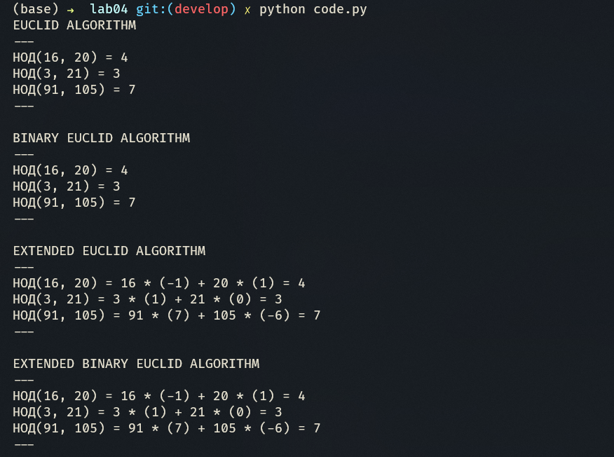

---
## Front matter
title: "Лабораторная работа №4"
subtitle: "Вычисление наибольшего общего делителя"
author: "Доборщук Владимир Владимирович, НФИмд-02-22"

## Generic otions
lang: ru-RU
toc-title: "Содержание"

## Bibliography
bibliography: bib/cite.bib
csl: /home/wdoborschuk/work/2022-2023/МОЗИиИБ/infosec/.report/pandoc/csl/gost-r-7-0-5-2008-numeric.csl

## Pdf output format
toc: true # Table of contents
toc-depth: 2
lof: true # List of figures
lot: true # List of tables
lol: true # List of listings
fontsize: 12pt
linestretch: 1.5
papersize: a4
documentclass: scrreprt
## I18n polyglossia
polyglossia-lang:
  name: russian
  options:
	- spelling=modern
	- babelshorthands=true
polyglossia-otherlangs:
  name: english
## I18n babel
babel-lang: russian
babel-otherlangs: english
## Fonts
mainfont: PT Serif
romanfont: PT Serif
sansfont: PT Sans
monofont: PT Mono
mainfontoptions: Ligatures=TeX
romanfontoptions: Ligatures=TeX
sansfontoptions: Ligatures=TeX,Scale=MatchLowercase
monofontoptions: Scale=MatchLowercase,Scale=0.9
## Biblatex
biblatex: true
biblio-style: "gost-numeric"
biblatexoptions:
  - parentracker=true
  - backend=biber
  - hyperref=auto
  - language=auto
  - autolang=other*
  - citestyle=gost-numeric
## Pandoc-crossref LaTeX customization
figureTitle: "Рис."
tableTitle: "Таблица"
listingTitle: "Листинг"
lofTitle: "Список иллюстраций"
lotTitle: "Список таблиц"
lolTitle: "Листинги"
## Misc options
code-block-font-size: \scriptsize
indent: true
header-includes:
  - \usepackage{indentfirst}
  - \usepackage{fvextra}
  - \usepackage{float} # keep figures where there are in the text
  - \floatplacement{figure}{H} # keep figures where there are in the text
  - \DefineVerbatimEnvironment{Highlighting}{Verbatim}{breaklines,commandchars=\\\{\}}
---

# Цель и задачи работы

Изучить алгоритмы вычисления наибольшего общего делителя

**Задачи:**

- Реализовать все представленные алгоритмы вычисления наибольшего общего делителя.

# Теоретическая информация

Целое число $d \neq 0$ называется *наибольшим общим делителем* целых чисел $a_1, a_2, \dots, a_k\quad(\text{Обозначатеся } d = \text{НОД}(a_1, a_2, \dots, a_k))$, если выполняются следующие условия:

1. каждое из чисел $a_1, a_2, \dots, a_k$ делится на $d$;
2. если $d_1 \neq 0$ - другой общий делитель чисел $a_1, a_2, \dots, a_k$, то $d$ делится на $d_1$. 

Для любых целых чисел $a_1, a_2, \dots, a_k$ существует наибольший общий делитель $d$ и его можно представить в виде *линейной комбинации* этих чисел:
\begin{equation}
    d = c_1a_1 + c_2a_2 + \dots + c_ka_K,\quad c_i \in \mathbb{Z} \quad (\mathbb{Z} - \text{множество целых чисел}) 
\end{equation}

Существует ряд алгоритмов, позволяющих вычислить значение наибольшего общего делителя для пары целых чисел $\text{НОД}(a,b)$:

- Алгоритм Евклида;
- Бинарный алгоритм Евклида;
- Расширенный алгоритм Евклида;
- Расширенный бинарный алгоритм Евклида.

# Выполнение лабораторной работы

Для реализации шифров мы будем использовать Python, так как его синтаксис позволяет быстро реализовать необходимые нам алгоритмы.

На вход каждой функции реализации алгоритмов у нас на вход подается пара ненулевых целых чисел $a$ и $b$. Также мы учитываем, что если у нас выполняется неравенство $a < b$, то мы меняем значения соответствующих переменных местами, для корректности выполнения алгоритмов.

Все реализации соответствуют алгоритмам, представленным в описании лабораторной работы.

## Реализация алгоритма Евклида

*Алгоритм Евклида* реализуем в виде функции `euclid` следующего вида:

```python
# --- Euclid Algorithm ---
def euclid(a: int, b: int):
    if a == 0 or b == 0:
        print("Non zero numbers should be used")
        return
    
    r_0 = a
    r_1 = b
    
    if a < b:
        r_0, r_1 = r_1, r_0
    
    while True:
        r =  r_0 % r_1
        if r == 0:
            return r_1
        
        r_0 = r_1
        r_1 = r
```

## Реализация бинарного алгоритма Евклида

*Бинарный алгоритм Евклида* реализуем в виде функции `binary_euclid` следующего вида:

```python
# --- Binary Euclid Algorithm ---
def binary_euclid(a: int, b: int):
    if a == 0 or b == 0:
        print("Non zero numbers should be used")
        return
    
    r_0 = a
    r_1 = b
    
    if a < b:
        r_0, r_1 = r_1, r_0
    
    g = 1
    
    while r_0 % 2 == 0 and r_1 % 2 == 0:
        r_0 = int(r_0 / 2)
        r_1 = int(r_1 / 2)
        g = 2*g
        
    u, v = r_0, r_1

    while u != 0:
        while u % 2 == 0:
            u = int(u / 2)
        while v % 2 == 0:
            v = int(v / 2)
        if u >= v:
            u = u - v
        else:
            v = v - u
        
    return g*v
```

## Реализация расширенного алгоритма Евклида

*Расширенный алгоритм Евклида* реализуем в виде функции `extended_euclid` следующего вида:

```python
# --- Extended Euclid Algorithm ---
def extended_euclid(a: int, b: int):
    if a == 0 or b == 0:
        print("Non zero numbers should be used")
        return
    
    r_0, r_1 = a, b
    
    x = [1, 0]
    y = [0, 1]
    
    if a < b:
        r_0, r_1 = r_1, r_0
        x, y = y, x
    
    while True:
        r =  r_0 % r_1
        if r == 0:
            return (r_1, x[1], y[1])
        
        q = int((r_0 - r)/r_1)
        r_0 = r_1
        r_1 = r
        
        x_ = x[0] - q*x[1]
        x[0] = x[1]
        x[1] = x_
        
        y_ = y[0] - q*y[1]
        y[0] = y[1]
        y[1] = y_
```

## Реализация расширенного бинарного алгоритма Евклида

*Расширенный бинарный алгоритм Евклида* реализуем в виде функции `extended_binary_euclid` следующего вида:

```python
# --- Extended Binary Euclid Algorithm ---
def extended_binary_euclid(a: int, b: int):
    if a == 0 or b == 0:
        print("Non zero numbers should be used")
        return
    
    r_0 = a
    r_1 = b
    
    A, B, C, D = 1, 0, 0, 1
    
    if a < b:
        r_0, r_1 = r_1, r_0
    
    g = 1
    
    while r_0 % 2 == 0 and r_1 % 2 == 0:
        r_0 = int(r_0 / 2)
        r_1 = int(r_1 / 2)
        g = 2*g
        
    u, v = r_0, r_1

    while u != 0:
        while u % 2 == 0:
            u = int(u / 2)
            if A % 2 ==0 and B % 2 == 0:
                A = int(A / 2)
                B = int(B / 2)
            else:
                A = int((A + r_1) / 2)
                B = int((B - r_0) / 2)
        while v % 2 == 0:
            v = int(v / 2)
            if C % 2 ==0 and D % 2 == 0:
                C = int(C / 2)
                D = int(D / 2)
            else:
                C = int((C + r_1) / 2)
                D = int((D - r_0) / 2)
        if u >= v:
            u = u - v
            A = A - C
            B = B - D
        else:
            v = v - u
            C = C - A
            D = D - B
        
    if a < b:
        C, D = D, C
    
    return (g*v, C, D)
```

## Тестирование

Для тестирования мы создали следующие функции, которые вызываем в блоке *Main*:

```python
# --- Tests ---

def test_euclid(a: list, b: list):
    print("EUCLID ALGORITHM\n---")
    result = list(map(lambda a, b: euclid(a, b), a, b))
    for i in range(0, len(a)):
        print(f'НОД({a[i]}, {b[i]}) = {result[i]}')
    print("---\n")
        
def test_binary_euclid(a: list, b: list):
    print("BINARY EUCLID ALGORITHM\n---")
    result = list(map(lambda a, b: binary_euclid(a, b), a, b))
    for i in range(0, len(a)):
        print(f'НОД({a[i]}, {b[i]}) = {result[i]}')
    print("---\n")

def test_extended_euclid(a: list, b: list):
    print("EXTENDED EUCLID ALGORITHM\n---")
    result = list(map(lambda a, b: extended_euclid(a, b), a, b))
    for i in range(0, len(a)):
        print(f'НОД({a[i]}, {b[i]}) = {a[i]} * ({result[i][1]}) + {b[i]} * ({result[i][2]}) = {result[i][0]}')
    print("---\n")
  
def test_extended_binary_euclid(a: list, b: list):
    print("EXTENDED BINARY EUCLID ALGORITHM\n---")
    result = list(map(lambda a, b: extended_binary_euclid(a, b), a, b))
    for i in range(0, len(a)):
        print(f'НОД({a[i]}, {b[i]}) = {a[i]} * ({result[i][1]}) + {b[i]} * ({result[i][2]}) = {result[i][0]}')
    print("---\n")
```

Данные тесты получают на вход списки чисел $\{a_1, a_2, \dots, a_k\}$ и $\{b_1, b_2, \dots, b_k\}$ и возврщают строки с результатом нахождения $\text{НОД}(a_i,b_i)$ в качестве результата.

Для расширенных алгоритмов, мы также получаем линейные комбинации пар чисел для получения наибольшего общего делителя.

Для их вызова, реализуем функцию `main` следующим образом:

```python
# --- Main ---

def main():
    a = [16, 3, 91]
    b = [20, 21, 105]
    
    test_euclid(a,b)
    test_binary_euclid(a,b)
    test_extended_euclid(a,b)
    test_extended_binary_euclid(a,b)
```

## Результаты тестирования

Запустив наш программный код, получим результат, изображенный на рисунке [-@fig:001].

{ #fig:001 width=100% }

Явно получим вот такой результат:

```text
EUCLID ALGORITHM
---
НОД(16, 20) = 4
НОД(3, 21) = 3
НОД(91, 105) = 7
---

BINARY EUCLID ALGORITHM
---
НОД(16, 20) = 4
НОД(3, 21) = 3
НОД(91, 105) = 7
---

EXTENDED EUCLID ALGORITHM
---
НОД(16, 20) = 16 * (-1) + 20 * (1) = 4
НОД(3, 21) = 3 * (1) + 21 * (0) = 3
НОД(91, 105) = 91 * (7) + 105 * (-6) = 7
---

EXTENDED BINARY EUCLID ALGORITHM
---
НОД(16, 20) = 16 * (-1) + 20 * (1) = 4
НОД(3, 21) = 3 * (1) + 21 * (0) = 3
НОД(91, 105) = 91 * (7) + 105 * (-6) = 7
---
```

Ручная проверка дает идентичные результаты, из чего можем сделать вывод, что алгоритмы реализованы корректно.

# Выводы

В рамках выполненной лабораторной работы мы изучили и реализовали алгоритмы вычисления наибольшего общего делителя.

# Список литературы{.unnumbered}

::: {#refs}
:::
