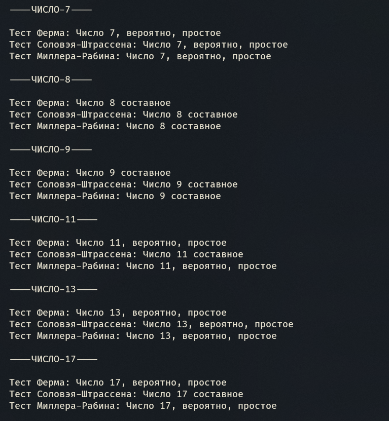

---
## Front matter
lang: ru-RU
title: Лабораторная работа №5
subtitle: Вероятностные алгоритмы проверки чисел на простоту
author:
  - Доборщук В.В.
institute:
  - Российский университет дружбы народов, Москва, Россия
date: 12 ноября 2022

## i18n babel
babel-lang: russian
babel-otherlangs: english

## Formatting pdf
toc: false
toc-title: Содержание
slide_level: 2
aspectratio: 169
section-titles: true
theme: metropolis
figureTitle: "Рис."
tableTitle: "Таблица"
header-includes:
 - \metroset{progressbar=frametitle,sectionpage=progressbar,numbering=fraction}
 - '\makeatletter'
 - '\beamer@ignorenonframefalse'
 - '\makeatother'
 - \usepackage{fvextra}
 - \DefineVerbatimEnvironment{Highlighting}{Verbatim}{breaklines,commandchars=\\\{\}}
---

# Информация

## Докладчик

:::::::::::::: {.columns align=center}
::: {.column width="70%"}

  * Доборщук Владимир Владимирович
  * студент группы НФИмд-02-22, студ. билет 1132223451
  * учебный ассистент кафедры прикладной информатики и теории вероятностей
  * Российский университет дружбы народов
  * [doborshchuk-vv@rudn.ru](mailto:doborshchuk-vv@rudn.ru)

:::
::: {.column width="30%"}


:::
::::::::::::::

# Цели и задачи

**Цель работы** --- изучить вероятностные алгоритмы проверки чисел на простоту.  

**Задачи:**

- Реализовать алгоритм вычисления символа Якоби;
- Реализовать вероятностные алгоритмы проверки чисел на простоту:
  - Тест Ферма;
  - Тест Соловэя-Штрассена;
  - Тест Миллера-Рабина.

# Теоретическое введение

Проверка чисел на простоту является составной частью алгоритмов генерации простых чисел, применяемых в криптографии с открытым ключом. Алгоритмы проверки на простоту можно разделить на *вероятностные* и *детерминированные*.

## Теоретическое введение

Для проверки на простоту числа $n$ вероятностным алгоритмом выбирают случайной число $a$ ($1 < a < n$) и проверяют условия алгоритма. Если число $n$ не проходит тест по основанию $a$, то алгоритм выдает результат "Число $n$ составное", и число $n$ действительно является составным.

## Теоретическое введение

Если же $n$ проходит тест по основанию $a$, ничего нельзя сказать о том, действительно ли число $n$ является простым. Последовательно проведя ряд проверок таким тестом для разных $a$ и получив для каждого из них ответ «Число $n$, вероятно, простое», можно утверждать, что число $a$ является простым с вероятностью, близкой к 1. После $t$ независимых выполнений теста вероятность того, что составное число $n$ будет $t$ раз объявлено простым (вероятность ошибки), не превосходит $\frac{1}{2^t}$.
  
# Выполнение лабораторной работы

Для реализации алгоритмов проверки на простоту и нахождения символа Якоби мы будем использовать Python, так как его синтаксис позволяет быстро реализовать необходимые нам алгоритмы.

На вход функций проверки числа на простоту подается одна целочисленная переменная, чье значение больше или равно 5. В случае реализации символа Якоби $\left(\frac{a}{n}\right)$ подается в функцию две переменные, при этом $n$ - нечетное число, $a$ - любое целое число, для которого выполняется условие $0 \le a < n$.

Все реализации соответствуют алгоритмам, представленным в описании лабораторной работы.

## Реалиазация сивола Якоби

*Символ Якоби* реализуем в видее функции `yakobi` следующего вида:

\scriptsize
```python
# --- Yakobi's Symbol ---
def yakobi(n: int, a: int):
    if n < 3:
        print("Число n должно быть больше или равно 3")
        return None
    if a < 0 or a >= n:
        print("Число a должны быть на интервале [0;n)")
        return None
    g = 1
    while a != 0 and a != 1:
        k = 0
        a_1 = a

        while divmod(a_1, 2)[1] != 1:
            a_1 = divmod(a_1, 2)[0]
        while (2**k)*a_1 != a:
            k += 1
```

## Реалиазация сивола Якоби

\scriptsize
```python
        s = 1
        if k % 2 == 0:
            s = 1
        else:
            if (n == 1 % 8) or (n == -1 % 8):
                s = 1
            elif (n == 3 % 8) or (n == -3 % 8):
                s = -1
        if a_1 == 1:
            return g * s
        if (n == 3 % 4) and (a_1 == 3 % 4):
            s = -s
        a = n % a_1
        n = a_1
        g = g * s
    if a == 0:
        return 0
    else:
        return g
```

## Тест Ферма

*Тест Ферма* реализуем в виде функции `fermats` следующего вида:

\scriptsize
```python
# --- Fermats Test ---
def fermats(n: int):
    if n < 5:
        print("N should be greater or equal to 5")
        return
    
    a = np.random.choice(range(2, n-1))
    
    if (a**(n-1)) % n == 1:
        return "Число " + str(n) + ", вероятно, простое"
    else:
        return "Число " + str(n) + " составное"
```

## Тест Соловэя-Штрассена

*Тест Соловэя-Штрассена* реализуем в виде функции `soloway_shtrassen` следующего вида:

\scriptsize
```python
# --- Soloway-Shtrassen Test ---
def soloway_shtrassen(n: int):
    if n % 2 == 0 or n < 5:
        return "Число " + str(n) + " составное"
    
    a = np.random.randint(2, n-1)
    r = int((a**((n-1)/2)) % n)
    
    if r != 1 and r != (n - 1):
        return "Число " + str(n) + " составное"
        
    s = yakobi(n, a)
    if r == s % n:
        return "Число " + str(n) + " составное"
    else:
        return "Число " + str(n) + ", вероятно, простое"
```

## Тест Миллера-Рабина

*Тест Миллера-Рабина* реализуем в виде функции `miller_rabin` следующего вида:

\scriptsize
```python
# --- Miller-Rabin Test ---
def miller_rabin(n: int):
    if n % 2 == 0 or n < 5:
        return "Число " + str(n) + " составное"
    
    r = n - 1
    s = 0
    
    while divmod(r, 2)[1] != 1:
        r = divmod(r, 2)[0]

    while (2**s)*r != n-1:
        s += 1
```

## Тест Миллера-Рабина

\scriptsize
```python
    a = np.random.randint(2, n-1)
    y = (a**r) % n
    
    if y != 1 and y != n - 1:
        j = 1
        while j <= s - 1 and y != n - 1:
            y = (y**2) % n
            if y == 1:
                return "Число " + str(n) + " составное"
            j = j + 1
        if y != n - 1:
            return "Число " + str(n) + " составное"
    
    return "Число " + str(n) + ", вероятно, простое"
```

## Тестирование

Для тестирования мы реализовали блок *Main* следующим образом:

\scriptsize
```python
def main():
    n = [7, 8, 9, 11, 13, 17, 19, 20, 21, 31, 32]
    
    for n_i in n:
        print(f'\n----ЧИСЛО-{n_i}----\n')
        print(f'Тест Ферма: {fermats(n_i)}')
        print(f'Тест Соловэя-Штрассена: {soloway_shtrassen(n_i)}')
        print(f'Тест Миллера-Рабина: {miller_rabin(n_i)}')
```

При такой реализации для каждого отдельного числа из списка мы будем вызывать каждый тест, и получим вывод от каждой из функциий.

## Результаты тестирования

Запустив наш программный код, получим результат, изображенный на рисунке.

{ #fig:001 width=40% }

# Выводы

В рамках выполненной лабораторной работы мы изучили и реализовали алгоритмы проверки числа на простоту.