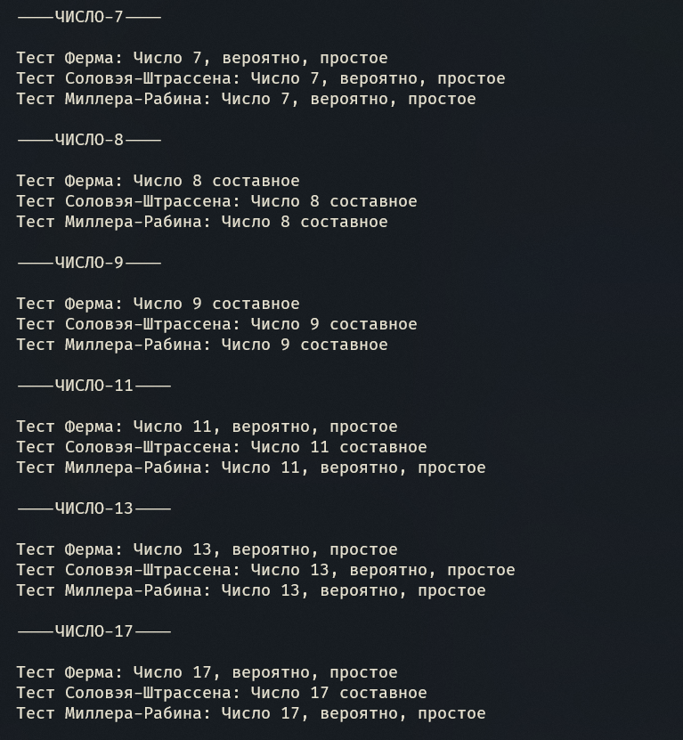

---
## Front matter
title: "Лабораторная работа №5"
subtitle: "Вероятностные алгоритмы проверки чисел на простоту"
author: "Доборщук Владимир Владимирович, НФИмд-02-22"

## Generic otions
lang: ru-RU
toc-title: "Содержание"

## Bibliography
bibliography: bib/cite.bib
csl: /home/wdoborschuk/work/2022-2023/МОЗИиИБ/infosec/.report/pandoc/csl/gost-r-7-0-5-2008-numeric.csl

## Pdf output format
toc: true # Table of contents
toc-depth: 2
lof: true # List of figures
lot: true # List of tables
lol: true # List of listings
fontsize: 12pt
linestretch: 1.5
papersize: a4
documentclass: scrreprt
## I18n polyglossia
polyglossia-lang:
  name: russian
  options:
	- spelling=modern
	- babelshorthands=true
polyglossia-otherlangs:
  name: english
## I18n babel
babel-lang: russian
babel-otherlangs: english
## Fonts
mainfont: PT Serif
romanfont: PT Serif
sansfont: PT Sans
monofont: Fira Code Retina
mainfontoptions: Ligatures=TeX
romanfontoptions: Ligatures=TeX
sansfontoptions: Ligatures=TeX,Scale=MatchLowercase
monofontoptions: Scale=MatchLowercase,Scale=0.9
## Biblatex
biblatex: true
biblio-style: "gost-numeric"
biblatexoptions:
  - parentracker=true
  - backend=biber
  - hyperref=auto
  - language=auto
  - autolang=other*
  - citestyle=gost-numeric
## Pandoc-crossref LaTeX customization
figureTitle: "Рис."
tableTitle: "Таблица"
listingTitle: "Листинг"
lofTitle: "Список иллюстраций"
lotTitle: "Список таблиц"
lolTitle: "Листинги"
## Misc options
code-block-font-size: \scriptsize
indent: true
header-includes:
  - \usepackage{indentfirst}
  - \usepackage{fvextra}
  - \usepackage{float} # keep figures where there are in the text
  - \floatplacement{figure}{H} # keep figures where there are in the text
  - \DefineVerbatimEnvironment{Highlighting}{Verbatim}{breaklines,commandchars=\\\{\}}
---

# Цель и задачи работы

**Цель:** Изучить вероятностные алгоритмы проверки чисел на простоту.  

**Задачи:**

- Реализовать алгоритм вычисления символа Якоби;
- Реализовать вероятностные алгоритмы проверки чисел на простоту:
  - Тест Ферма;
  - Тест Соловэя-Штрассена;
  - Тест Миллера-Рабина.

# Теоретическая информация

В настоящее время в системах защиты информации широко используются несимметричные криптографические преобразования информации с целью ее защиты. В связи с ростом вычислительных мощностей для обеспечения требуемого уровня стойкости криптографических систем необходимо использовать простые числа все большей разрядности, тем самым повышая трудоемкость вычислительных операций криптографических алгоритмов [@коломийцева2019сравнительный].

Проверка чисел на простоту является составной частью алгоритмов генерации простых чисел, применяемых в криптографии с открытым ключом. Алгоритмы проверки на простоту можно разделить на вероятностные и детерминированные.

Детерминированный алгоритм всегда действует по одной и той же схеме и гарантированно решает поставленную задачу (или не дает никакого ответа). Вероятностный алгоритм использует генератор случайных чисел и дает не гарантированно точный ответ. Вероятностные алгоритмы в общем случае не менее эффективны, чем детерминированные (если используемый генератор случайных чисел всегда дает набор одних и тех же чисел, зависящих от входных данных, то вероятностный алгоритм становится детерминированным).

Для проверки на простоту числа $n$ вероятностным алгоритмом выбирают случайной число $a$ ($1 < a < n$) и проверяют условия алгоритма. Если число $n$ не проходит тест по основанию $a$, то алгоритм выдает результат "Число $n$ составное", и число $n$ действительно является составным.

Если же $n$ проходит тест по основанию $a$, ничего нельзя сказать о том, действительно ли число $n$ является простым. Последовательно проведя ряд проверок таким тестом для разных $a$ и получив для каждого из них ответ «Число $n$, вероятно, простое», можно утверждать, что число $a$ является простым с вероятностью, близкой к 1. После $t$ независимых выполнений теста вероятность того, что составное число $n$ будет $t$ раз объявлено простым (вероятность ошибки), не превосходит $\frac{1}{2^t}$.

Для реализации у нас представлены тесты Ферма, Соловэя-Штрассена и Миллера-Рабина. В тесте Соловэя-Штрассена используется символ Якоби $\left(\frac{a}{n}\right)$, нахождение которого нам также потребуется реализовать.

# Выполнение лабораторной работы

Для реализации алгоритмов проверки на простоту и нахождения символа Якоби мы будем использовать Python, так как его синтаксис позволяет быстро реализовать необходимые нам алгоритмы.

На вход функций проверки числа на простоту подается одна целочисленная переменная, чье значение больше или равно 5. В случае реализации символа Якоби $\left(\frac{a}{n}\right)$ подается в функцию две переменные, при этом $n$ - нечетное число, $a$ - любое целое число, для которого выполняется условие $0 \le a < n$.

Все реализации соответствуют алгоритмам, представленным в описании лабораторной работы.

## Реалиазация сивола Якоби

*Символ Якоби* реализуем в видее функции `yakobi` следующего вида:

```python
# --- Yakobi's Symbol ---
def yakobi(n: int, a: int):
    if n < 3:
        print("Число n должно быть больше или равно 3")
        return None
    
    if a < 0 or a >= n:
        print("Число a должны быть на интервале [0;n)")
        return None
    
    g = 1
    
    while a != 0 and a != 1:
        k = 0
        a_1 = a

        while divmod(a_1, 2)[1] != 1:
            a_1 = divmod(a_1, 2)[0]

        while (2**k)*a_1 != a:
            k += 1
        
        s = 1
        if k % 2 == 0:
            s = 1
        else:
            if (n == 1 % 8) or (n == -1 % 8):
                s = 1
            elif (n == 3 % 8) or (n == -3 % 8):
                s = -1
        
        if a_1 == 1:
            return g * s
        
        if (n == 3 % 4) and (a_1 == 3 % 4):
            s = -s

        a = n % a_1
        n = a_1
        g = g * s

    if a == 0:
        return 0
    else:
        return g
```

## Тест Ферма

*Тест Ферма* реализуем в виде функции `fermats` следующего вида:

```python
# --- Fermats Test ---
def fermats(n: int):
    if n < 5:
        print("N should be greater or equal to 5")
        return
    
    a = np.random.choice(range(2, n-1))
    
    if (a**(n-1)) % n == 1:
        return "Число " + str(n) + ", вероятно, простое"
    else:
        return "Число " + str(n) + " составное"
```

## Тест Соловэя-Штрассена

*Тест Соловэя-Штрассена* реализуем в виде функции `soloway_shtrassen` следующего вида:

```python
# --- Soloway-Shtrassen Test ---
def soloway_shtrassen(n: int):
    if n % 2 == 0 or n < 5:
        return "Число " + str(n) + " составное"
    
    a = np.random.randint(2, n-1)
    r = int((a**((n-1)/2)) % n)
    
    if r != 1 and r != (n - 1):
        return "Число " + str(n) + " составное"
        
    s = yakobi(n, a)
    if r == s % n:
        return "Число " + str(n) + " составное"
    else:
        return "Число " + str(n) + ", вероятно, простое"
```

## Тест Миллера-Рабина

*Тест Миллера-Рабина* реализуем в виде функции `soloway_shtrassen` следующего вида:

```python
# --- Miller-Rabin Test ---
def miller_rabin(n: int):
    if n % 2 == 0 or n < 5:
        return "Число " + str(n) + " составное"
    
    r = n - 1
    s = 0
    
    while divmod(r, 2)[1] != 1:
        r = divmod(r, 2)[0]

    while (2**s)*r != n-1:
        s += 1
    
    a = np.random.randint(2, n-1)
    y = (a**r) % n
    
    if y != 1 and y != n - 1:
        j = 1
        while j <= s - 1 and y != n - 1:
            y = (y**2) % n
            if y == 1:
                return "Число " + str(n) + " составное"
            j = j + 1
        if y != n - 1:
            return "Число " + str(n) + " составное"
    
    return "Число " + str(n) + ", вероятно, простое"
```

## Тестирование

Для тестирования мы реализовали блок *Main* следующим образом:

```python
def main():
    n = [7, 8, 9, 11, 13, 17, 19, 20, 21, 31, 32]
    
    for n_i in n:
        print(f'\n----ЧИСЛО-{n_i}----\n')
        print(f'Тест Ферма: {fermats(n_i)}')
        print(f'Тест Соловэя-Штрассена: {soloway_shtrassen(n_i)}')
        print(f'Тест Миллера-Рабина: {miller_rabin(n_i)}')
```

При такой реализации для каждого отдельного числа из списка мы будем вызывать каждый тест, и получим вывод от каждой из функциий.

## Результаты тестирования

Запустив наш программный код, получим результат, изображенный на рисунке [-@fig:001].

{ #fig:001 width=100% }

Явно получим вот такой результат:

```text
----ЧИСЛО-7----

Тест Ферма: Число 7, вероятно, простое
Тест Соловэя-Штрассена: Число 7, вероятно, простое
Тест Миллера-Рабина: Число 7, вероятно, простое

----ЧИСЛО-8----

Тест Ферма: Число 8 составное
Тест Соловэя-Штрассена: Число 8 составное
Тест Миллера-Рабина: Число 8 составное

----ЧИСЛО-9----

Тест Ферма: Число 9 составное
Тест Соловэя-Штрассена: Число 9 составное
Тест Миллера-Рабина: Число 9 составное

----ЧИСЛО-11----

Тест Ферма: Число 11, вероятно, простое
Тест Соловэя-Штрассена: Число 11 составное
Тест Миллера-Рабина: Число 11, вероятно, простое

----ЧИСЛО-13----

Тест Ферма: Число 13, вероятно, простое
Тест Соловэя-Штрассена: Число 13, вероятно, простое
Тест Миллера-Рабина: Число 13, вероятно, простое

----ЧИСЛО-17----

Тест Ферма: Число 17, вероятно, простое
Тест Соловэя-Штрассена: Число 17 составное
Тест Миллера-Рабина: Число 17, вероятно, простое

----ЧИСЛО-19----

Тест Ферма: Число 19, вероятно, простое
Тест Соловэя-Штрассена: Число 19 составное
Тест Миллера-Рабина: Число 19, вероятно, простое

----ЧИСЛО-20----

Тест Ферма: Число 20 составное
Тест Соловэя-Штрассена: Число 20 составное
Тест Миллера-Рабина: Число 20 составное

----ЧИСЛО-21----

Тест Ферма: Число 21 составное
Тест Соловэя-Штрассена: Число 21 составное
Тест Миллера-Рабина: Число 21 составное

----ЧИСЛО-31----

Тест Ферма: Число 31, вероятно, простое
Тест Соловэя-Штрассена: Число 31 составное
Тест Миллера-Рабина: Число 31, вероятно, простое

----ЧИСЛО-32----

Тест Ферма: Число 32 составное
Тест Соловэя-Штрассена: Число 32 составное
Тест Миллера-Рабина: Число 32 составное
```

# Выводы

В рамках выполненной лабораторной работы мы изучили и реализовали алгоритмы проверки числа на простоту.

# Список литературы{.unnumbered}

::: {#refs}
:::
