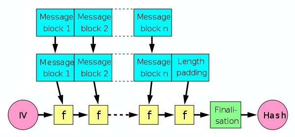

---
## Front matter
lang: ru-RU
title: Семейство хэш-функций SHA. SHA-512
subtitle: Индивидуальный доклад
author:
  - Доборщук В.В.
institute:
  - Российский университет дружбы народов, Москва, Россия
date: 15 ноября 2022

## i18n babel
babel-lang: russian
babel-otherlangs: english

## Formatting pdf
toc: false
toc-title: Содержание
slide_level: 2
aspectratio: 169
section-titles: true
theme: metropolis
figureTitle: "Рис."
tableTitle: "Таблица"
header-includes:
 - \metroset{progressbar=frametitle,sectionpage=progressbar,numbering=fraction}
 - '\makeatletter'
 - '\beamer@ignorenonframefalse'
 - '\makeatother'
 - \usepackage{fvextra}
 - \DefineVerbatimEnvironment{Highlighting}{Verbatim}{breaklines,commandchars=\\\{\}}
---

# Информация

## Докладчик

:::::::::::::: {.columns align=center}
::: {.column width="70%"}

  * Доборщук Владимир Владимирович
  * студент группы НФИмд-02-22, студ. билет 1132223451
  * учебный ассистент кафедры прикладной информатики и теории вероятностей
  * Российский университет дружбы народов
  * [doborshchuk-vv@rudn.ru](mailto:doborshchuk-vv@rudn.ru)

:::
::: {.column width="30%"}


:::
::::::::::::::

# Цели и задачи

**Цель работы** --- изучить семейство хеш-функций SHA.  

**Задачи:**

- Рассмотреть алгоритмы хэш-функций семейства;
- В частности рассмотреть алгоритм SHA-512.

# Введение

**Хеш-функция** - это вычислительный метод, который может отображать неопределенный размер данных в фиксированный размер данных. Или, проще говоря, преобразование выводит числовое значение, которое характеризуется входными данными. Криптографическая хэш-функция использует необратимые (односторонние) математические функции, чтобы сгенерировать хеш-значение из входных данных. Одним из распространенных способов генерации криптографических хешей является использование блочных шифров.

## Требования к хэш-функциям

К надежным с точки зрения криптографии хеш-функциям должны быть предъявлены следующие основные требования:

1. Хеш-функция должна представлять из себя одностороннюю функцию т.е. по образу (хешу) невозможно или почти невозможно найти исходный прообраз (сообщение).
2. Функция хеширования должна быть устойчива к коллизиям. Коллизия – это пара исходных сообщений, имеющая одинаковое выходное значение. Считается, что относительно быстрое нахождение коллизии в алгоритме хеширования делает подобный алгоритм ненадёжным с точки зрения криптоанализа.

Перейдем к подробному рассмотрению и оценке семейства хэш-функций SHA.

# Семейство хеш-функций SHA

- SHA-1
- SHA-2 (SHA-224, SHA-256, SHA-384, SHA-512, SHA-512/256 и SHA-512/224)
- SHA-3

## SHA-1

Secure Hash Algorithm 1 — алгоритм криптографического хеширования. Описан в RFC 3174. Для входного сообщения произвольной длины (максимум $2^{64} − 1$ бит, что равно 2 эксабайта) алгоритм генерирует 160-битное хеш-значение, называемое также дайджестом сообщения. Используется во многих криптографических приложениях и протоколах.

## Описание алгоритма SHA-1

SHA-1 реализует хеш-функцию, построенную на идее функции сжатия. Входами функции сжатия являются блок сообщения длиной 512 бит и выход предыдущего блока сообщения. Выход представляет собой значение всех хеш-блоков до этого момента. Иными словами хеш блока $M_i$ равен $h_i = f(M_i, h_{i-1})$. Хеш-значением всего сообщения является выход последнего блока.

Исходное сообщение разбивается на блоки по 512 бит в каждом. Последний блок дополняется до длины, кратной 512 бит.

Инициализируются пять 32-битовых переменных.

\scriptsize
```text
A = a = 0x67452301
B = b = 0xEFCDAB89
C = c = 0x98BADCFE
D = d = 0x10325476
E = e = 0xC3D2E1F0
```

## Описание алгоритма SHA-1

Определяются четыре нелинейные операции и четыре константы.

\begin{align*}
F_t(m,l,k) = (m \wedge l) \vee (\bar m \wedge k), \quad K_t = \text{0x5A827999}, \quad 0 \le t \le 19\\
F_t(m,l,k) = m \oplus l \oplus k, \quad K_t = \text{0x6ED9EBA1}, \quad 20 \le t \le 39\\
F_t(m,l,k) = (m \wedge l) \vee (m \wedge k) \vee (l \wedge k), \quad K_t = \text{0x8F1BBCDC}, \quad 40 \le t \le 59\\
F_t(m,l,k) = m \oplus l \oplus k, \quad K_t = \text{0xCA62C1D6}, \quad 60 \le t \le 79\\
\end{align*}

## Описание алгоритма SHA-1

Далее, главный цикл итеративно обрабатывает каждый 512-битный блок. В начале каждого цикла вводятся переменные `a`, `b`, `c`, `d`, `e`, которые инициализируются значениями `A`, `B`, `C`, `D`, `E`, соответственно. Блок сообщения преобразуется из шестнадцати 32-битовых слов $M_{i}$ в восемьдесят 32-битовых слов $W_j$ по следующему правилу:

\begin{align*}
W_t = M_t \quad \text{при } 0 \le t \le 15\\
W_t = (W_{t-3} \oplus W_{t-8} \oplus W_{t-14} \oplus W_{t-16}) << 1 \quad \text{при } 16 \le t \le 79,\\
\end{align*}

где $<<$ - это циклический сдвиг влево, операция сдвига двоичного представления передаваемого значения на $n$ бит влево (в нашем случае сдвиг будет равен 1).

## Описание алгоритма SHA-1

\begin{align*}
\text{для } t & \text{ от 0 до 79}\\
              & \text{temp} = (a << 5) + F_t(b,c,d) + e + W_t + K_t\\
              & e = d\\
              & d = c\\
              & c = b << 30\\
              & b = a\\
              & a = \text{temp},
\end{align*}

где "+" — сложение беззнаковых 32-битных целых чисел с отбрасыванием избытка (33-го бита).

После этого к `A`, `B`, `C`, `D`, `E` прибавляются значения `a`, `b`, `c`, `d`, `e`, соответственно.

## SHA-2

Хеш-функции семейства SHA-2 построены на основе структуры Меркла — Дамгора.

{ #fig:001 width=70% }

## Характеристики SHA-2

\tiny

: Технические характеристики SHA-2 {#tbl:sha-differ}

+-------------------------------+---------------------------------+-----------------------------------+-------------------+------------------------------------+-------------------+-----------------------------+------------------+
| Хеш-функция                   | Длина дайджеста сообщения (бит) | Длина внутреннего состояния (бит) | Длина блока (бит) | Максимальная длина сообщения (бит) | Длина слова (бит) | Количество итераций в цикле | Скорость (MiB/s) |
+===============================+=================================+===================================+===================+====================================+===================+=============================+==================+
| SHA‑256\                      | 256/\                           | 256 (8 × 32)\                     | 512\              | $2^{64} - 1$\                      | 32\               | 64\                         | 139\             |
| SHA‑224                       | 224                             | -//-                              | -//-              | -//-                               | -//-              | -//-                        | -//-             |
+===============================+=================================+===================================+===================+====================================+===================+=============================+==================+
| SHA‑512\                      | 512/\                           | 512 (8 × 64)\                     | 1024\             | $2^{128} - 1$\                     | 64\               | 80\                         | 154\             |
| SHA‑384\                      | 384/\                           | -//-\                             | -//-\             | -//-\                              | -//-\             | -//-\                       | -//-\            |
| SHA‑512/256\                  | 256/\                           | -//-\                             | -//-\             | -//-\                              | -//-\             | -//-\                       | -//-\            |
| SHA‑512/224                   | 224                             | -//-                              | -//-              | -//-                               | -//-              | -//-                        | -//-             |
+-------------------------------+---------------------------------+-----------------------------------+-------------------+------------------------------------+-------------------+-----------------------------+------------------+

\normalsize

## Особенности SHA-2

В SHA-2 используются следующие логические операторы:

- $||$ — конкатенация,
- $+$ — сложение,
- $\text{AND}$ — побитовое «И»,
- $\text{XOR}$ — исключающее «ИЛИ»,
- $\text{SHR}$ — логический сдвиг вправо,
- $\text{ROTR}$ — циклический сдвиг вправо.

## SHA-512

SHA-512 очень близок к SHA-256, за исключением того, что он использует 1024 битные «блоки» и принимает в качестве входных данных длину строки длиной $2^{128}$ бит. SHA-512 также имеет другие алгоритмические модификации по сравнению с SHA-256. SHA-512 имеет структуру:

- слова имеют длину 64 бита,
- используется 80 раундов вместо 64,
- сообщение разбито на чанки по 1024 бит,
- начальные значения переменных и константы расширены до 64 бит,
- постоянные для каждого из 80 раундов — 80 первых простых чисел,
- сдвиг в операциях $\text{rotr}$ и $\text{shr}$ производится на другое число позиций.

Ввиду алгоритмической схожести SHA-2 с SHA-1 и наличия у последней потенциальных уязвимостей принято решение, что SHA-3 будет базироваться на совершенно ином алгоритме. 2 октября 2012 года NIST утвердил в качестве SHA-3 алгоритм Keccak.

## SHA-3

SHA-3 (Keccak) – алгоритм хеширования переменной разрядности, разработанный группой во главе с Йоаном Дайменом в 2012 году. 5 августа 2015 года алгоритм утверждён и опубликован в качестве стандарта FIPS 202. Алгоритм SHA-3 построен по принципу криптографической губки.

В его основе произошли следующие изменения:

- Количество раундов было увеличено с 12 + $l$ до 12 + 2$l$;
- Padding был изменён со сложной формы на более простую;
- Скорость (rate) $r$ была увеличена до предела безопасности (ранее округлялась вниз до ближайшей степени 2).

## Схема SHA-3

Схема SHA-3 (Keccak) состоит из двух этапов:

1. Absorbing (впитывание). Исходное сообщение $M$ подвергается многораундовым перестановкам $f$.
2. Squeezing (отжатие). Вывод получившегося в результате перестановок значения $Z$.

{ #fig:002 width=60% }

# Заключение

В рамках изучения семейства хэш-функций SHA, мы:

- изучили историю возникновения семейства и его путь изменения, развития;
- узнали о критериях оценки хэш-функций (по которым проходит криптоанализ алгоритмов): односторонности и минимизация коллизий;
- выяснили, какие уязвимости присутствуют у SHA-1 и SHA-2, при этом - они практически идентичны, а также изучили разницу между поколенями хэш-функций;
- нашли информацию о том, что SHA-1 больше не используется, повсеместно сейчас используют алгоритмы SHA-2, и вероятен переход в будущем на SHA-3. 

## Список использованной литературы

1. Eastlake D., Jones P. September 2001, US Secure Hash Algorithm 1 (SHA1). RFC 3174.
2. Burr W.E. NIST Comments on Cryptanalytic Attacks on SHA-1 // NIST. govComputer Security Division-Computer Security Resource Center [online]. 2006.
3. Ferguson N., Schneier B., Kohno T. Cryptography engineering: design principles and practical applications. John Wiley & Sons, 2011.
4. Hansen T., Eastlake D.E. US secure hash algorithms (SHA and HMAC-SHA) // RFC 4634. 2006.
5. Coron J.-S. и др. Merkle-Damgård revisited: How to construct a hash function // Annual International Cryptology Conference. Springer, 2005. С. 430–448.
6. Gilbert H., Handschuh H. Security analysis of SHA-256 and sisters // International workshop on selected areas in cryptography. Springer, 2003. С. 175–193.
7. Bertoni G. и др. Keccak // Annual international conference on the theory and applications of cryptographic techniques. Springer, 2013. С. 313–314.