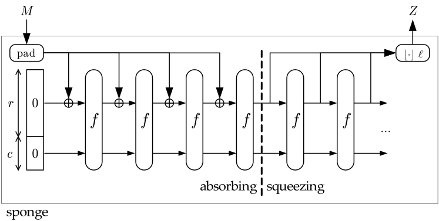
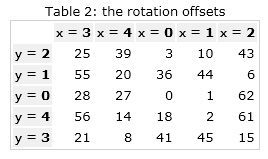

---
## Front matter
title: "Семейство хэш-функций SHA. SHA-512"
subtitle: "Индивидуальный доклад"
author: "Доборщук Владимир Владимирович, НФИмд-02-22"

## Generic otions
lang: ru-RU
toc-title: "Содержание"

## Bibliography
bibliography: bib/cite.bib
csl: /home/wdoborschuk/work/2022-2023/МОЗИиИБ/infosec/.report/pandoc/csl/gost-r-7-0-5-2008-numeric.csl

## Pdf output format
toc: true # Table of contents
toc-depth: 2
lof: true # List of figures
lot: true # List of tables
lol: true # List of listings
fontsize: 12pt
linestretch: 1.5
papersize: a4
documentclass: scrreprt
## I18n polyglossia
polyglossia-lang:
  name: russian
  options:
	- spelling=modern
	- babelshorthands=true
polyglossia-otherlangs:
  name: english
## I18n babel
babel-lang: russian
babel-otherlangs: english
## Fonts
mainfont: PT Serif
romanfont: PT Serif
sansfont: PT Sans
monofont: Fira Code Retina
mainfontoptions: Ligatures=TeX
romanfontoptions: Ligatures=TeX
sansfontoptions: Ligatures=TeX,Scale=MatchLowercase
monofontoptions: Scale=MatchLowercase,Scale=0.9
## Biblatex
biblatex: true
biblio-style: "gost-numeric"
biblatexoptions:
  - parentracker=true
  - backend=biber
  - hyperref=auto
  - language=auto
  - autolang=other*
  - citestyle=gost-numeric
## Pandoc-crossref LaTeX customization
figureTitle: "Рис."
tableTitle: "Таблица"
listingTitle: "Листинг"
lofTitle: "Список иллюстраций"
lotTitle: "Список таблиц"
lolTitle: "Листинги"
## Misc options
code-block-font-size: \scriptsize
indent: true
header-includes:
  - \usepackage{indentfirst}
  - \usepackage{fvextra}
  - \usepackage{float} # keep figures where there are in the text
  - \floatplacement{figure}{H} # keep figures where there are in the text
  - \DefineVerbatimEnvironment{Highlighting}{Verbatim}{breaklines,commandchars=\\\{\}}
---

# Цели и задачи

**Цель работы** --- изучить семейство хэш-функций SHA.  

**Задачи:**

- Рассмотреть алгоритмы хэш-функций семейства;
- В частности рассмотреть алгоритм SHA-512.

# Введение

В настоящее время информационная безопасность стала неотъемлемой частью любых цифровых операций. Ключевой роль в защите информации играет понятие криптографической функции. Криптографические хеш-функции — это выделенный класс хеш-функций, который имеет определённые свойства, делающие его пригодным для использования в криптографии.

Преобразование, производимое хеш-функцией, называется хешированием. Исходные данные называются входным массивом, «ключом» или «сообщением». Результат преобразования (выходные данные) называется «хешем», «хеш-кодом», «хеш-суммой».

Иными словами, хеш-функция - это вычислительный метод, который может отображать неопределенный размер данных в фиксированный размер данных. Или, проще говоря, преобразование выводит числовое значение, которое характеризуется входными данными. Криптографическая хэш-функция использует необратимые (односторонние) математические функции, чтобы сгенерировать хеш-значение из входных данных. Одним из распространенных способов генерации криптографических хешей является использование блочных шифров.

## Требования к хэш-функциям

К надежным с точки зрения криптографии хеш-функциям должны быть предъявлены следующие основные требования:

1. Хеш-функция должна представлять из себя одностороннюю функцию т.е. по образу (хешу) невозможно или почти невозможно найти исходный прообраз (сообщение).
2. Функция хеширования должна быть устойчива к коллизиям. Коллизия – это пара исходных сообщений, имеющая одинаковое выходное значение. Считается, что относительно быстрое нахождение коллизии в алгоритме хеширования делает подобный алгоритм ненадёжным с точки зрения криптоанализа.

Перейдем к подробному рассмотрению и оценке семейства хэш-функций SHA.

# Семейство хэш-функций SHA

## SHA-1

Secure Hash Algorithm 1 — алгоритм криптографического хеширования. Описан в RFC 3174 [@eastlakeseptember]. Для входного сообщения произвольной длины (максимум $2^{64} − 1$ бит, что равно 2 эксабайта) алгоритм генерирует 160-битное хеш-значение, называемое также дайджестом сообщения. Используется во многих криптографических приложениях и протоколах. Принципы, положенные в основу SHA-1, аналогичны тем, которые использовались Рональдом Ривестом при проектировании MD4.

**Описание алгоритма**

SHA-1 реализует хеш-функцию, построенную на идее функции сжатия. Входами функции сжатия являются блок сообщения длиной 512 бит и выход предыдущего блока сообщения. Выход представляет собой значение всех хеш-блоков до этого момента. Иными словами хеш блока $M_i$ равен $h_i = f(M_i, h_{i-1})$. Хеш-значением всего сообщения является выход последнего блока.

Исходное сообщение разбивается на блоки по 512 бит в каждом. Последний блок дополняется до длины, кратной 512 бит. Сначала добавляется 1 а потом нули, чтобы длина блока стала равной (512 - 64 = 448) бит. В оставшиеся 64 бита записывается длина исходного сообщения в битах. Если последний блок имеет длину более 448, но менее 512 бит, дополнение выполняется следующим образом: сначала добавляется 1, затем нули вплоть до конца 512-битного блока; после этого создается ещё один 512-битный блок, который заполняется вплоть до 448 бит нулями, после чего в оставшиеся 64 бита записывается длина исходного сообщения в битах. Дополнение последнего блока осуществляется всегда, даже если сообщение уже имеет нужную длину.

Инициализируются пять 32-битовых переменных.

```text
A = a = 0x67452301
B = b = 0xEFCDAB89
C = c = 0x98BADCFE
D = d = 0x10325476
E = e = 0xC3D2E1F0
```

Определяются четыре нелинейные операции и четыре константы.

\begin{align*}
F_t(m,l,k) = (m \wedge l) \vee (\bar m \wedge k), \quad K_t = \text{0x5A827999}, \quad 0 \le t \le 19\\
F_t(m,l,k) = m \oplus l \oplus k, \quad K_t = \text{0x6ED9EBA1}, \quad 20 \le t \le 39\\
F_t(m,l,k) = (m \wedge l) \vee (m \wedge k) \vee (l \wedge k), \quad K_t = \text{0x8F1BBCDC}, \quad 40 \le t \le 59\\
F_t(m,l,k) = m \oplus l \oplus k, \quad K_t = \text{0xCA62C1D6}, \quad 60 \le t \le 79\\
\end{align*}

Далее, главный цикл итеративно обрабатывает каждый 512-битный блок. В начале каждого цикла вводятся переменные `a`, `b`, `c`, `d`, `e`, которые инициализируются значениями `A`, `B`, `C`, `D`, `E`, соответственно. Блок сообщения преобразуется из шестнадцати 32-битовых слов $M_{i}$ в восемьдесят 32-битовых слов $W_j$ по следующему правилу:

\begin{align*}
W_t = M_t \quad \text{при } 0 \le t \le 15\\
W_t = (W_{t-3} \oplus W_{t-8} \oplus W_{t-14} \oplus W_{t-16}) << 1 \quad \text{при } 16 \le t \le 79,\\
\end{align*}

где $<<$ - это циклический сдвиг влево, операция сдвига двоичного представления передаваемого значения на $n$ бит влево (в нашем случае сдвиг будет равен 1).

\begin{align*}
\text{для } t & \text{ от 0 до 79}\\
              & \text{temp} = (a << 5) + F_t(b,c,d) + e + W_t + K_t\\
              & e = d\\
              & d = c\\
              & c = b << 30\\
              & b = a\\
              & a = \text{temp},
\end{align*}

где "+" — сложение беззнаковых 32-битных целых чисел с отбрасыванием избытка (33-го бита).

После этого к `A`, `B`, `C`, `D`, `E` прибавляются значения `a`, `b`, `c`, `d`, `e`, соответственно. Начинается следующая итерация.

Итоговым значением будет объединение пяти 32-битовых слов (`A`, `B`, `C`, `D`, `E`) в одно 160-битное хеш-значение.

**Криптоанализ**

Для исследования уязвимости предлагается рассмотреть задачи нахождения коллизий и прообраза. При использования брутфорса (метода "грубой силы"), получаем следующие результаты:

- для нахождения коллизий требуется в среднем $2^{80}$ операция (при использовании атаки Дней рождения);
- для нахождения прообраза требуется $2^{160}$ операций.

Ввиду того, что теоретические атаки на SHA-1 оказались успешными, NIST планирует полностью отказаться от использования SHA-1 в цифровых подписях [@burr2006nist].

Из-за блочной и итеративной структуры алгоритмов, а также отсутствия специальной обработки в конце хеширования, все хеш-функции семейства SHA уязвимы для атак удлинением сообщения и коллизиям при частичном хешировании сообщения [@ferguson2011cryptography].

## SHA-2

**SHA-2** - это семейство криптографических алгоритмов — однонаправленных хеш-функций, включающее в себя алгоритмы **SHA-224**, **SHA-256**, **SHA-384**, **SHA-512**, **SHA-512/256** и **SHA-512/224** [@hansen2006us].

**Описание хэш-функций**

Хеш-функции семейства SHA-2 построены на основе структуры Меркла — Дамгора [@coron2005merkle]. Исходное сообщение после дополнения разбивается на блоки, каждый блок — на 16 слов. Алгоритм пропускает каждый блок сообщения через цикл с 64 или 80 итерациями (раундами). На каждой итерации 2 слова преобразуются, функцию преобразования задают остальные слова. Результаты обработки каждого блока складываются, сумма является значением хеш-функции. Тем не менее, инициализация внутреннего состояния производится результатом обработки предыдущего блока. Поэтому независимо обрабатывать блоки и складывать результаты нельзя.

В таблице [-@tbl:sha-differ] показаны некоторые технические характеристики различных вариантов SHA-2. «Внутреннее состояние» обозначает промежуточную хеш-сумму после обработки очередного блока данных:

\footnotesize

: Технические характеристики SHA-2 {#tbl:sha-differ}

+-------------------------------+---------------------------------+-----------------------------------+-------------------+------------------------------------+-------------------+-----------------------------+------------------+
| Хеш-функция                   | Длина дайджеста сообщения (бит) | Длина внутреннего состояния (бит) | Длина блока (бит) | Максимальная длина сообщения (бит) | Длина слова (бит) | Количество итераций в цикле | Скорость (MiB/s) |
+===============================+=================================+===================================+===================+====================================+===================+=============================+==================+
| SHA‑256\                      | 256/\                           | 256 (8 × 32)\                     | 512\              | $2^{64} - 1$\                      | 32\               | 64\                         | 139\             |
| SHA‑224                       | 224                             | -//-                              | -//-              | -//-                               | -//-              | -//-                        | -//-             |
+===============================+=================================+===================================+===================+====================================+===================+=============================+==================+
| SHA‑512\                      | 512/\                           | 512 (8 × 64)\                     | 1024\             | $2^{128} - 1$\                     | 64\               | 80\                         | 154\             |
| SHA‑384\                      | 384/\                           | -//-\                             | -//-\             | -//-\                              | -//-\             | -//-\                       | -//-\            |
| SHA‑512/256\                  | 256/\                           | -//-\                             | -//-\             | -//-\                              | -//-\             | -//-\                       | -//-\            |
| SHA‑512/224                   | 224                             | -//-                              | -//-              | -//-                               | -//-              | -//-                        | -//-             |
+-------------------------------+---------------------------------+-----------------------------------+-------------------+------------------------------------+-------------------+-----------------------------+------------------+

\normalsize

В SHA-2 используются следующие логические операторы:

- $||$ — конкатенация,
- $+$ — сложение,
- $\text{AND}$ — побитовое «И»,
- $\text{XOR}$ — исключающее «ИЛИ»,
- $\text{SHR}$ — логический сдвиг вправо,
- $\text{ROTR}$ — циклический сдвиг вправо.

```groovy
Пояснения:
 Все переменные беззнаковые, имеют размер 32 бита и при вычислениях суммируются по модулю 232
 message — исходное двоичное сообщение
 m — преобразованное сообщение

 Инициализация переменных
 (первые 32 бита дробных частей квадратных корней первых восьми простых чисел [от 2 до 19]):
h0 := 0x6A09E667
h1 := 0xBB67AE85
h2 := 0x3C6EF372
h3 := 0xA54FF53A
h4 := 0x510E527F
h5 := 0x9B05688C
h6 := 0x1F83D9AB
h7 := 0x5BE0CD19

Таблица констант
(первые 32 бита дробных частей кубических корней первых 64 простых чисел [от 2 до 311]):
k[0..63] :=
    0x428A2F98, 0x71374491, 0xB5C0FBCF, 0xE9B5DBA5, 0x3956C25B, 0x59F111F1, 0x923F82A4, 0xAB1C5ED5,
    0xD807AA98, 0x12835B01, 0x243185BE, 0x550C7DC3, 0x72BE5D74, 0x80DEB1FE, 0x9BDC06A7, 0xC19BF174,
    0xE49B69C1, 0xEFBE4786, 0x0FC19DC6, 0x240CA1CC, 0x2DE92C6F, 0x4A7484AA, 0x5CB0A9DC, 0x76F988DA,
    0x983E5152, 0xA831C66D, 0xB00327C8, 0xBF597FC7, 0xC6E00BF3, 0xD5A79147, 0x06CA6351, 0x14292967,
    0x27B70A85, 0x2E1B2138, 0x4D2C6DFC, 0x53380D13, 0x650A7354, 0x766A0ABB, 0x81C2C92E, 0x92722C85,
    0xA2BFE8A1, 0xA81A664B, 0xC24B8B70, 0xC76C51A3, 0xD192E819, 0xD6990624, 0xF40E3585, 0x106AA070,
    0x19A4C116, 0x1E376C08, 0x2748774C, 0x34B0BCB5, 0x391C0CB3, 0x4ED8AA4A, 0x5B9CCA4F, 0x682E6FF3,
    0x748F82EE, 0x78A5636F, 0x84C87814, 0x8CC70208, 0x90BEFFFA, 0xA4506CEB, 0xBEF9A3F7, 0xC67178F2

Предварительная обработка:
m := message || [единичный бит]
m := m || [k нулевых бит], где k — наименьшее неотрицательное число, такое, что 
                 (L + 1 + K) mod 512 = 448, где L — число бит в сообщении (сравнима по модулю 512 c 448)
m := m || Длина(message) — длина исходного сообщения в битах в виде 64-битного числа
            с порядком байтов от старшего к младшему

Далее сообщение обрабатывается последовательными порциями по 512 бит:
разбить сообщение на куски по 512 бит
для каждого куска
    разбить кусок на 16 слов длиной 32 бита (с порядком байтов от старшего к младшему внутри слова): w[0..15]

    Сгенерировать дополнительные 48 слов:
    для i от 16 до 63
        s0 := (w[i-15] rotr 7) xor (w[i-15] rotr 18) xor (w[i-15] shr 3)
        s1 := (w[i-2] rotr 17) xor (w[i-2] rotr 19) xor (w[i-2] shr 10)
        w[i] := w[i-16] + s0 + w[i-7] + s1

    Инициализация вспомогательных переменных:
    a := h0
    b := h1
    c := h2
    d := h3
    e := h4
    f := h5
    g := h6
    h := h7

    Основной цикл:
    для i от 0 до 63
        Σ0 := (a rotr 2) xor (a rotr 13) xor (a rotr 22)
        Ma := (a and b) xor (a and c) xor (b and c)
        t2 := Σ0 + Ma
        Σ1 := (e rotr 6) xor (e rotr 11) xor (e rotr 25)
        Ch := (e and f) xor ((not e) and g)
        t1 := h + Σ1 + Ch + k[i] + w[i]

        h := g
        g := f
        f := e
        e := d + t1
        d := c
        c := b
        b := a
        a := t1 + t2

    Добавить полученные значения к ранее вычисленному результату:
    h0 := h0 + a
    h1 := h1 + b 
    h2 := h2 + c
    h3 := h3 + d
    h4 := h4 + e
    h5 := h5 + f
    h6 := h6 + g 
    h7 := h7 + h

Получить итоговое значение хеша:
digest = hash = h0 || h1 || h2 || h3 || h4 || h5 || h6 || h7
```

SHA-512 очень близок к SHA-256, за исключением того, что он использует 1024 битные «блоки» и принимает в качестве входных данных длину строки длиной $2^{128}$ бит. SHA-512 также имеет другие алгоритмические модификации по сравнению с SHA-256.

SHA-512 имеет структуру:

- слова имеют длину 64 бита,
- используется 80 раундов вместо 64,
- сообщение разбито на чанки по 1024 бит,
- начальные значения переменных и константы расширены до 64 бит,
- постоянные для каждого из 80 раундов — 80 первых простых чисел,
- сдвиг в операциях $\text{rotr}$ и $\text{shr}$ производится на другое число позиций.

Начальные значения переменных `h0`-`h7` в SHA-512:

```
h0: = 0x6a09e667f3bcc908
h1: = 0xbb67ae8584caa73b
h2: = 0x3c6ef372fe94f82b
h3: = 0xa54ff53a5f1d36f1
h4: = 0x510e527fade682d1
h5: = 0x9b05688c2b3e6c1f
h6: = 0x1f83d9abfb41bd6b
h7: = 0x5be0cd19137e2179
```

Некоторые области применения SHA-2 представлены в таблице [-@tbl:sha2-usage].

: Области применения SHA-2 {#tbl:sha2-usage}

| Область применения     | Детали                                                                                                                                                    |
| ---------------------- | --------------------------------------------------------------------------------------------------------------------------------------------------------- |
| DNSSEC                 | SHA-256 дайджесты DNSKEY в протоколе DNSSEC                                                                                                               |
| DSA                    | Семейство SHA-2 используется для создания электронной цифровой подписи                                                                                    |
| IPSec                  | Некоторые реализации поддерживают SHA-256 в протоколах ESP и IKE                                                                                          |
| OpenLDAP               | SHA-256, SHA-384 или SHA-512 хеши паролей                                                                                                                 |
| PGP                    | SHA-256, SHA-384, SHA-512 используются для создания электронной цифровой подписи                                                                          |
| S/MIME                 | SHA-224, SHA-256, SHA-384 или SHA-512 дайджесты сообщений                                                                                                 |
| SHACAL-2               | Блочный алгоритм шифрования SHACAL-2 построен на основе хеш-функции SHA-256                                                                               |
| X.509                  | SHA-224, SHA-256, SHA-384 и SHA-512 используются для создания электронной цифровой подписи сертификата                                                    |
| Биткойн                | Нахождение комбинации данных, SHA-256-хеш которых удовлетворяет оговоренному условию, является доказательством выполнения работы при эмиссии криптовалюты |

**Криптоанализ**

В 2003 году Гилберт и Хандшух провели исследование SHA-2, но не нашли каких-либо уязвимостей [@gilbert2003security]. Однако в марте 2008 года индийские исследователи Сомитра Кумар Санадия и Палаш Саркар опубликовали найденные ими коллизии для 22 итераций SHA-256 и SHA-512. В сентябре того же года они представили метод конструирования коллизий для усечённых вариантов SHA-2 (21 итерация). Позднее были найдены методы конструирования коллизий для 31 итерации SHA-256 и для 27 итераций SHA-512.

Ввиду алгоритмической схожести SHA-2 с SHA-1 и наличия у последней потенциальных уязвимостей принято решение, что SHA-3 будет базироваться на совершенно ином алгоритме. 2 октября 2012 года NIST утвердил в качестве SHA-3 алгоритм Keccak.

## SHA-3

SHA-3 (Keccak) – алгоритм хеширования переменной разрядности, разработанный группой во главе с Йоаном Дайменом в 2012 году [@bertoni2013keccak]. 5 августа 2015 года алгоритм утверждён и опубликован в качестве стандарта FIPS 202. Алгоритм SHA-3 построен по принципу криптографической губки.

Алгоритм Keccak был разработан Гвидо Бертони, Йоаном Дайменом, Жилем Ван Аше из STMicroelectronics и Микаэлем Питерсом из NXP.

В его основе произошли следующие изменения:

- Количество раундов было увеличено с 12 + $l$ до 12 + 2$l$;
- Padding был изменён со сложной формы на более простую;
- Скорость (rate) $r$ была увеличена до предела безопасности (ранее округлялась вниз до ближайшей степени 2).

Keccak основан на конструкции Sponge. Это означает, что для получения хеша нужно проделать следующие незамысловатые действия: взять исходное сообщение $M$ и дополнить его до длины кратной $r$. В виде формулы их можно изобразить следующим образом: $M=M||\text{0x01}||\text{0x00}||..||\text{0x00}||\text{0x80}$. То есть к сообщению дописывается единичный байт, необходимое количество нулей и завершается байт со значением 0x80. Все вышесказанное справедливо только для случаев, когда добавляется более одного байта. Однако в случае, если необходимо дополнить всего один байт, то достаточно добавить лишь 0x81.

Затем для каждого блока $M_i$ длиной $r$ бит выполняем:

1. Сложение по модулю 2 с первыми $r$-битами набора начальных состояний $S$. Перед началом работы функции все элементы $S$ будут равны нулю.
2. $N$ раз применяем к полученным в результате данным функцию $f$. Набором начальных состояний $S$ для блока $M_i+1$ будет результат последнего раунда блока $M_i$.
3. После того как все блоки $M_i$ закончатся взять итоговый результат и вернуть его в качестве хеш-значения.

Хеш-функция Keccak реализована таким образом, что функцию перестановки $f$, применяемую для каждого блока $M_i$, пользователь может выбирать самостоятельно из набора предопределенных функции $b=\left\{f-25, f-50, f-100, f-200, f-400, f-800, f-1600\right\}$.

Для использования функции $f-800$, необходимо выбрать такие $r$ и $c$, чтобы выполнялось равенство $r+c=800$. Кроме того, изменяя значения $r$ и $c$, вы тем самым изменяете количество раундов вашей хеш-функции. Т.к. количество оных вычисляется по формуле $n=12+2l$, где $2l=(b/25)$. Так для $b=1600$, Количество раундов равно 24.

Однако хотя пользователь в праве выбирать для своей реализации любую из предложенных авторами функций, следует отметить что в качестве стандарта SHA-3 принята только функция **Keccak-1600** и авторы всячески рекомендуют пользоваться только ею. Так в качестве основных значений для хешей разной длины авторы выбрали следующие параметры:

- SHA-224: `r` = 1156, `c` = 448 (вернуть первые 28 байт результат)
- SHA-256: `r` = 1088, `c` = 512 (вернуть первые 32 байт результат)
- SHA-384: `r` = 832, `c` = 768 (вернуть первые 48 байт результат)
- SHA-512: `r` = 576, `c` = 1024 (вернуть первые 64 байт результат)

Схема SHA-3 (Keccak) состоит из двух этапов:

1. **Absorbing (впитывание)**. Исходное сообщение $M$ подвергается многораундовым перестановкам $f$.
2. **Squeezing (отжатие)**. Вывод получившегося в результате перестановок значения $Z$.



Функция Keccak представляет из себя следующее:

```java
Keccak[r,c](M) {
 Initialization and padding
 for(int x=0; x<5; x++)
   for(int y=0; y<5; y++)
     S[x,y] = 0;
 P = M || 0x01 || 0x00 || … || 0x00;
 P = P xor (0x00 || … || 0x00 || 0x80);
 //Absorbing phase
 forall block Pi in P
 for(int x=0; x<5; x++)
   for(int y=0; y<5; y++)
     S[x,y] = S[x,y] xor Pi[x+5*y];
   S = Keccak-f[r+c](S);
 //Squeezing phase
 Z = empty string;
do
{
 for(int x=0; x<5; x++)
   for(int y=0; y<5; y++)
     if((x+5y)<r/w)  
       Z = Z || S[x,y];
   S = Keccak-f[r+c](S)
}  while output is requested
 return Z;
}
```

На этапе **Absorbig** производится вычисление хеш значения, а на этапе **Squeezing** вывод результатов до тех пор пока не будет достигнута требуемая длина хеша.

Этап **Absorbig** можно представить в виде следующей функции:

```groovy
Keccak-f[b](A) 
{
 forall i in 0…nr-1
   A = Round[b](A, RC[i])
 return A
}
```

Здесь `b` - это значение выбранной функции (по умолчанию 1600), а функция `Round()` - псевдослучайная перестановка, применяемая на каждом раунде. Количество раундов `nr` вычисляется из значений `r` и `c`. Операции выполняемые на каждом раунде представляют из себя следующую функцию:

```groovy
Round[b](A,RC)
{
 θ step
 for(int x=0; x<5; x++)
   C[x] = A[x,0] xor A[x,1] xor A[x,2] xor A[x,3] xor A[x,4];
 for(int x=0; x<5; x++)
   D[x] = C[x-1] xor rot(C[x+1],1);
 for(int x=0; x<5; x++)
   A[x,y] = A[x,y] xor D[x];

 ρ and π steps
 for(int x=0; x<5; x++)
   for(int y=0; y<5; y++)
     B[y,2*x+3*y] = rot(A[x,y], r[x,y]);

 χ step
 for(int x=0; x<5; x++)
   for(int y=0; y<5; y++)
     A[x,y] = B[x,y] xor ((not B[x+1,y]) and B[x+2,y]);

 ι step
 A[0,0] = A[0,0] xor RC

 return A
}
```

Тут 4 шага на каждом из которых над входящими данными производится ряд логических действий. Здесь функция `rot(X,n)` обозначает циклический сдвиг элемента `X` на `n` позиций. Массив `r[]` представляет собой предопределенный набор значений, в котором указывается на сколько необходимо сдвигать байты на каждом раунде:



Массив `RC` это набор констант, которые тоже являются предопределенными:


# Заключение

В рамках изучения семейства хэш-функций SHA, мы:

- изучили историю возникновения семейства и его путь изменения, развития;
- узнали о критериях оценки хэш-функций (по которым проходит криптоанализ алгоритмов): односторонности и минимизация коллизий;
- выяснили, какие уязвимости присутствуют у SHA-1 и SHA-2, при этом - они практически идентичны, а также изучили разницу между поколенями хэш-функций;
- нашли информацию о том, что SHA-1 больше не используется, повсеместно сейчас используют алгоритмы SHA-2, и вероятен переход в будущем на SHA-3. 

# Список литературы{.unnumbered}

::: {#refs}
:::
